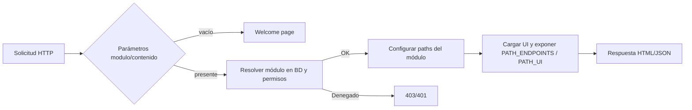

# Motor Principal (engine.php)

## Descripción general
`backend/engine.php` es el orquestador central de PHLEXMOD. Resuelve navegación, valida permisos, prepara el entorno (configuración, traducciones, paths) y carga dinámicamente las vistas (`ui/`) y endpoints (`endpoints/`) de cada módulo.

Diagrama de alto nivel:


## Inicialización del sistema
- Incluye configuración y utilidades básicas:
  - `core-config.php`: constantes globales (paths, URLs, vendors, DB).
  - `encryption.php`: cifrado/descifrado de parámetros.
  - `config.php`: ajustes específicos de la app.
- Carga traducciones del idioma activo:
```php
$translations = loadTranslations($lang);
```

## Resolución de navegación
- Si no hay `modulo`/`contenido`, se sirve la bienvenida:
```php
if (empty($desencriptar($_REQUEST['modulo'] ?? null)) && empty($desencriptar($_REQUEST['contenido'] ?? null))) {
    include PHLEXMOD_CORE_PATH.'welcome-page.php';
    return;
}
```
- Si están presentes, se consulta el menú/privilegios en BD para:
  - Verificar acceso del usuario.
  - Obtener `directorio`/`enlace` del módulo y su UI de entrada.

## Carga dinámica de módulos
- Ubicación base de módulos: `backend/modules/`.
- Anatomía estándar de un módulo:
  - `ui/`: vistas PHP (formularios, tablas, modales).
  - `endpoints/`: APIs `.api.php` (y, si aplica, `.db.php`, `.logic.php`).
  - `js/`, `css/`, `tests/` (opcional).
- Engine prepara variables JS globales para el módulo cargado:
```html
<script>
  window.PATH_UI = '.../backend/modules/<ns>/<modulo>/ui/';
  window.PATH_ENDPOINTS = '.../backend/modules/<ns>/<modulo>/endpoints/';
</script>
```
- La UI incluída puede usar esas rutas para AJAX y fragmentos.

## Seguridad y permisos (RBAC)
- Hoy: resolución por menú/privilegios desde BD.
- Roadmap: permisos declarativos por módulo mediante `module.json` y middleware antes de despachar endpoints.

## Manejo de errores
- 401/403 en acceso denegado.
- 404 si la UI/endpoint no existe.
- 500 ante errores internos (log a `storage/logs/`).

## Integración con frontend
- `frontend/templates/sistema/header.php` carga vendors transversales mediante `vendor_loader.php` y luego el framework (`config` y `phlexmod`).
- Recomendación: vendors pesados (p.e. editores/exportadores) cargarlos de forma condicional en la vista del módulo.

## Constantes y paths relevantes (definidos en `core-config.php`)
- `PHLEXMOD_FRONTEND_PATH`, `PHLEXMOD_BACKEND_PATH`, `PHLEXMOD_MODULES_PATH`
- `PHLEXMOD_VENDOR_PATH`, `PHLEXMOD_ASSETS_PATH`
- `PHLEXMOD_BASE_URL`, `PHLEXMOD_WEB_URL`
- Configuración de WebSocket y de base de datos.

## Roadmap de extensibilidad
- Descubrimiento de módulos por manifiesto `module.json` (auto-registro).
- Carga de vendors específicos de cada módulo declarados en el manifiesto.
- Hooks de ciclo de vida: `preInstall`, `postInstall`, `preUninstall`.
- CLI/Asistente web para scaffolding de módulos.
