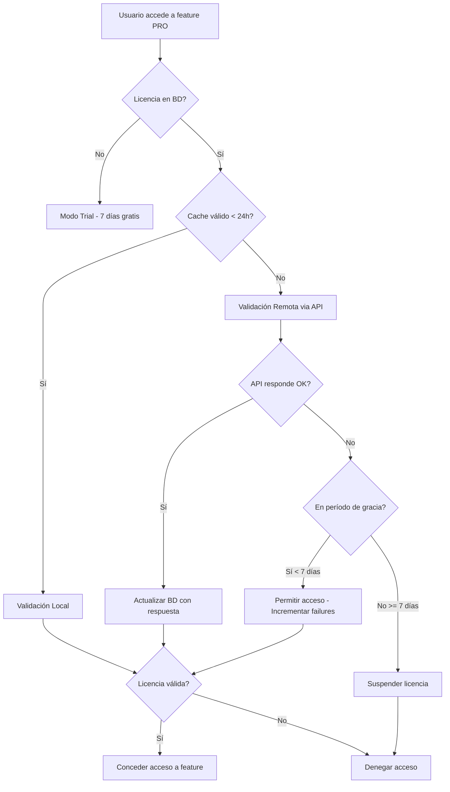

> ⚠️ **TRANSLATION PENDING:** This document is currently in Spanish. Contributions to translate it to English are welcome.

# PHLEXMOD License System (Public Overview)

Sistema híbrido de licenciamiento con validación local y remota.

## 📦 Componentes del Sistema

### 1. Database Table
- **Tabla:** `setting_license`
- **Ubicación:** `installs/pro/db/03_license_tables.sql`
- **Campos clave:**
  - `license_key`: Clave de licencia única
  - `installation_id`: Hash único del servidor
  - `expires_at`: Fecha de expiración
  - `features_enabled`: JSON con features habilitadas
  - `status`: trial, active, expired, suspended
  - `validation_failures`: Contador de fallos consecutivos

### 2. Core Classes

#### LicenseManager (`backend/core/LicenseManager.php`)
Gestión CRUD de licencias:
```php
$manager = new LicenseManager();

// Obtener licencia actual
$license = $manager->getLicense();

// Guardar/actualizar licencia
$manager->saveLicense('PHLEXMOD-PRO-XXXX', $apiResponse);

// Verificar expiración
if ($manager->isExpired()) {
    // Licencia expirada
}

// Obtener resumen
$status = $manager->getStatusSummary();
```

#### LicenseValidator (`backend/core/LicenseValidator.php`)
Validación híbrida (local + remota):
```php
$validator = new LicenseValidator();

// Validar (usa cache local si < 24h)
$result = $validator->validate();

// Forzar validación remota
$result = $validator->validate(true);

// Validación periódica (para cron)
$validator->periodicValidation();
```

#### LicenseMiddleware (`backend/core/LicenseMiddleware.php`)
Control de acceso a features:
```php
$license = new LicenseMiddleware();

// Verificar feature (lanza excepción si no disponible)
try {
    $license->checkFeature('2fa');
    // Código de2FA aquí
} catch (Exception $e) {
    // Feature no disponible
}

// Verificar sin excepción
if ($license->hasFeature('feature_x')) {
    // Código condicionado por feature
}

// Para endpoints HTTP (auto-response 403)
$license->httpCheckFeature('email_provider');
```

## 🔧 Configuración

### Constantes en `core-config.php`
```php
// Endpoint del servidor de licencias (referencia pública)
define('PHLEXMOD_LICENSE_API', 'https://licenses.example.com/api/validate');

// Período de gracia (días sin validación antes de suspender)
define('PHLEXMOD_LICENSE_GRACE_PERIOD', 7);

// Edición del framework (ejemplo)
define('PHLEXMOD_EDITION', 'COMMUNITY');
```

## 🚀 Uso en Módulos PRO

### Ejemplo 1: Proteger módulo de 2FA
```php
// backend/modules/profile/enable-2fa.php
<?php
session_start();
require_once '../../core/LicenseMiddleware.php';

use FlexMod\Core\LicenseMiddleware;

$license = new LicenseMiddleware();
$license->httpCheckFeature('2fa'); // Auto-exit si no disponible

// Tu código de 2FA aquí...
```

### Ejemplo 2: Feature condicional
```php
// backend/modules/dashboard/index.php
$license = new LicenseMiddleware();

if ($license->hasFeature('websockets')) {
    // Mostrar notificaciones en tiempo real
    include 'websocket-notifications.php';
} else {
    // Polling tradicional
    include 'polling-notifications.php';
}
```

### Ejemplo 3: Mostrar estado de licencia
```php
// backend/modules/settings/license-status.php
$license = new LicenseMiddleware();
$status = $license->getStatus();

echo json_encode([
    'status' => $status['status'],          // trial, active, expired, suspended
    'message' => $status['message'],        // "15 days remaining"
    'features' => $status['features'],      // {"2fa": true, ...}
    'is_trial' => $license->isTrialMode()
]);
```

## ⏰ Cron Job

### Configuración
Agregar al crontab (ejecutar diariamente a las 2 AM):
```bash
0 2 * * * php /var/www/html/phlexmod/backend/cron/validate-license.php >> /var/www/html/phlexmod/logs/license_cron.log 2>&1
```

### Qué hace el cron:
1. Valida la licencia remotamente (forzado)
2. Actualiza `features_enabled` según respuesta del API
3. Incrementa `validation_failures` si falla
4. Suspende licencia si failures >= 7 días
5. Registra resultado en `logs/license_validation.log`

## 📡 API del Servidor de Licencias

Esta sección ha sido redactada para la versión pública del repositorio. Los detalles de implementación del API, contratos y respuestas se mantienen en documentación privada del producto.

## 🎯 Flujo de Validación



## 📝 Logs

### Ubicaciones
- **Validación general:** `logs/license_validation.log`
- **Acceso a features:** `logs/license_access.log`
- **Errores de cron:** `logs/license_cron_error.log`

### Ejemplo de log de acceso
```
[2025-11-26 19:00:00] Feature: 2fa | Granted: YES | Reason: Access granted | User: admin | IP: 192.168.1.100
[2025-11-26 19:05:00] Feature: binance | Granted: NO | Reason: Feature not enabled in license | User: user1 | IP: 192.168.1.101
```

## ⚠️ Consideraciones de Seguridad

1. **Installation ID**: Se genera basado en características únicas del servidor (IP, hostname, directorio). No puede ser transferido fácilmente.

2. **Período de Gracia**: Permite 7 días de funcionamiento sin conexión al servidor de licencias. Evita bloqueos por problemas de red.

3. **Modo Degradado**: Si la licencia expira, el sistema NO se bloquea completamente. Solo desactiva features PRO.

4. **Trial Mode**: Sin licencia, el sistema inicia en modo trial con características limitadas.

## 🔍 Troubleshooting

### "License validation failed: cURL error"
- Verificar conectividad a `https://licenses.jagmedia.com.ve`
- Revisar firewall del servidor
- Modo degradado activo por 7 días

### "Feature not enabled in license"
- Verificar `features_enabled` en tabla `setting_license`  
- Contactar soporte para upgrade de licencia

### "License suspended (validation failed)"
- Han pasado > 7 días sin validación exitosa
- Verificar conectividad al API
- Ejecutar cron manualmente: `php backend/cron/validate-license.php`

## 📞 Soporte

Para problemas con licencias:
- Email: soporte@jagmedia.com.ve
- Panel: https://licenses.jagmedia.com.ve/panel
- Logs: Revisar `logs/license_*.log`
