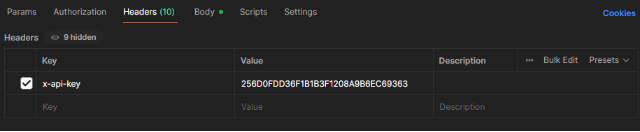
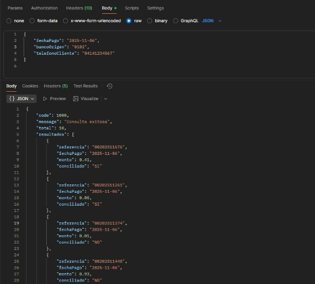

> ⚠️ **TRANSLATION PENDING:** This document is currently in Spanish. Contributions to translate it to English are welcome.



**API CONCILIACION-MULTIPLE – DUMMY (Calidad) **

|**Documentación técnica** **Control de versiones** |**Fecha: 07/11/2025** |||||
| :-: | - | :- | :- | :- | :- |
|**Nombre del Servicio** |**Versión** |**Fecha** |**Nueva Versión** |**Descripción del cambio** ||
|API Conciliación Múltiple - DUMMY |1 |||||
**Introducción** 

Este documento contiene los parámetros de configuración que se deben seguir para realizar las pruebas de integración de los servicios. La información proporcionada es para un único uso e incluye imágenes de ejemplo para una mejor comprensión. 

**Descripción**

Permite consultar todos los pagos móviles recibidos por un cliente 

**Método**

POST 

**URL** https://bdvconciliacionqa.banvenez.com:444/api/consulta/consultaMultiple/v2 

**Header (se debe indicar los datos exactamente como se muestra en el cuadro)** 

|**Servicio** |Conciliación múltiple - Dummy|Nombre del Servicio. |
| - | - | - |
|**Tipo** |POST |Tipo de petición. |
|**Header** |X-API-Key  256D0FDD36F1B1B3F1208A9B6EC69363 |Api Key único generado por el cliente. |
|**Content-Type** |Application/json |Tipo de entrada.  |
|**EndPoint** |api/consulta/consultaMultiple/v2 |Url para el consumo del api. |

**Parámetros de la solicitud** 

|"fechaPago": " **2025-11-06**"|Fecha de la transacción |
| - | - |
|"bancoOrigen": "**0102**"|Código de banco origen |
|"telefonoCliente": " **04141234567**"|Número de teléfono del cliente origen |

**Parámetros de la Respuesta Exitosa (JSON)**  

**Code**: código de respuesta (**1000)** 

**Message**: detalle de la acción (**"Consulta exitosa"**)** 

**Total:** Total de transacciones que coinciden con los parámetros (**“1”**) **Resultado**: Detalle de la transacción ([**{** 

`            `**"referencia": "00202511676", (referencia de la operación)** 

`            `**"fechaPago": "2025-11-06", (fecha de la operación)** 

`            `**"monto": 0.41, (monto de la operación)** 

`            `**"conciliado": "SI" (Estado de la conciliación)** 

`        `**}]** 

) 

**Json de entrada (se debe colocar la data exactamente como se indica en el ejemplo)** 

**{** 

`    `**"fechaPago": "2025-11-06",** 

`    `**"bancoOrigen": "0102",** 

`    `**"telefonoCliente": "04141234567" }** 

**Json de salida (exitoso)** 

**{** 

`    `**"code": 1000,** 

`    `**"message": "Consulta exitosa",** 

`    `**"total": 10,** 

`    `**"resultados": [** 

`        `**{** 

`            `**"referencia": "00202511676",             "fechaPago": "2025-11-06",             "monto": 0.41,** 

`            `**"conciliado": "SI"** 

`        `**},** 

`    `**]** 

**}** 

**Nota: al final del documento se muestran los registros exactos que debe obtener como respuesta si los datos en el JSON de entrada son correctos.** 

**Json de salida (sin datos encontrados)** 

**{** 

`    `**"code": 1010,** 

`    `**"message": "No hay datos disponibles",     "total": 0,** 

`    `**"resultados": null** 

**}** 

**Nota: esta salida se repite si alguno de los parámetros se envía vacío.** 

**Json de salida (con formato de fecha errado)** 

**{** 

`    `**"timestamp": "2025-10-03T14:03:16.628+00:00",     "path": "/api/consulta/consultaMultiple",** 

`    `**"status": 400,** 

`    `**"error": "Bad Request",** 

`    `**"requestId": "85c88034-2"** 

**}** 

**Json de salida (Api Key errado)** 

**{** 

`    `**"code": 1001,** 

`    `**"message": "Cliente no afiliado al producto",     "total": 0,** 

`    `**"resultados": null** 

**}** 

**Nota: Por favor es importante tomar en consideración los códigos de respuestas que retorna el servicio.** 

|Código de consultas exitosas  |Code: **1000**|
| - | - |
|Código de consultas no exitosas |Code: **1010**|

**Ejemplos:** 

- **Headers** 

- **Body y respuesta (BDV A BDV)** 

**{** 

`    `**"code": 1000,** 

`    `**"message": "Consulta exitosa",** 

`    `**"total": 10,** 

`    `**"resultados": [** 

`        `**{** 

`            `**"referencia": "00202511676",             "fechaPago": "2025-11-06",** 

`            `**"monto": 0.41,** 

`            `**"conciliado": "SI"** 

`        `**},** 

`        `**{** 

`            `**"referencia": "00202511261",             "fechaPago": "2025-11-06",             "monto": 0.05,** 

`            `**"conciliado": "SI"** 

`        `**},** 

`        `**{** 

`            `**"referencia": "00202511374",             "fechaPago": "2025-11-06",             "monto": 0.01,** 

`            `**"conciliado": "NO"** 

`        `**},** 

`        `**{** 

`            `**"referencia": "00202511448",             "fechaPago": "2025-11-06",             "monto": 0.93,** 

`            `**"conciliado": "NO"** 

`        `**},** 

`        `**{** 

`            `**"referencia": "00202511335",             "fechaPago": "2025-11-06",             "monto": 0.22,** 

`            `**"conciliado": "SI"** 

`        `**},** 

`        `**{** 

`            `**"referencia": "00202511192",             "fechaPago": "2025-11-06",             "monto": 0.31,** 

`            `**"conciliado": "NO"** 

`        `**},** 

`        `**{** 

`            `**"referencia": "00202511873",             "fechaPago": "2025-11-06",             "monto": 0.33,** 

`            `**"conciliado": "NO"** 

`        `**},** 

`        `**{** 

`            `**"referencia": "00202511874",             "fechaPago": "2025-11-06",             "monto": 0.82,** 

`            `**"conciliado": "NO"** 

`        `**},** 

`        `**{** 

`            `**"referencia": "00202511765",             "fechaPago": "2025-11-06",             "monto": 0.14,** 

`            `**"conciliado": "NO"** 

`        `**},** 

`        `**{** 

`            `**"referencia": "00202511461",             "fechaPago": "2025-11-06",             "monto": 0.78,** 

`            `**"conciliado": "NO"** 

`        `**}** 

`    `**]** 

**}** 
**Av. Universidad, esquina Sociedad, Edificio Banco de Venezuela, Caracas, Distrito Capital                                                                                                              Rif: G-20009997-6      **

