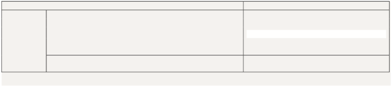
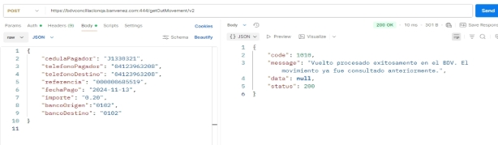

> ⚠️ **TRANSLATION PENDING:** This document is currently in Spanish. Contributions to translate it to English are welcome.



**API Consulta de Operaciones Salientes (Calidad) **

|**Documentación técnica** **Control de versiones** |**Fecha: 26/03/25** ||||||
| :-: | - | :- | :- | :- | :- | :- |
|**Nombre del Servicio** |**Versión** |**Fecha** |**Nueva Versión** |**Descripción del cambio** |||
|API Consulta de Operaciones Salientes  |1 |07/11/2025 |2 |Ajuste en los mensajes de respuesta  |||

**Documentación  Descripción**

Permite conciliar los pagos realizados por un jurídico.   Características Principales / Ventajas: 

- Conciliar el pago móvil enviado en línea y en tiempo real . 
- Integración sencilla a los sistemas. 

**Método**

POST 

**URL [https://bdvconciliacionqa.banvenez.com:444/getOutMovement/v2 ](https://bdvconciliacionqa.banvenez.com:444/getOutMovement/v2)**

**Header** 

**(se debe indicar los datos exactamente como se muestra en el cuadro)** 

Observaciones 

**Servicio**  Conciliación de Movimientos  Nombre del Servicio 

**Tipo**  Post  Tipo de petición 

**Header**  X-API-Key    256D0FDD36F1B1B3F1208A9B6EC693  Empresa de prueba 

**Content-** Application/json  Tipo de entrada Json 

**Type** 

**EndPoint**  https://bdvconciliacionqa.banvenez.com:444/getOutMovem Ésta es la URL a donde se debe hacer la 

ent/v2  petición para el consumo del API  (QA) 

**Parámetros de la solicitud** 

|"cedulaPagador": "J1330321",|Número de RIF del pagador|
| - | - |
|"telefonoPagador": "04123963208",|Número de teléfono de quien ejecuta el pago|
|"telefonoDestino": "04123963208",|Número de teléfono de quien recibe el pago|
|"referencia": "000000685519", |Número de referencia resultado de la operación|
|"fechaPago": "2024-11-13",|Fecha del pago|
|"importe": "0.20",|Importe del pago, debe colocar los decimales con “.”|
|"bancoOrigen": "0102"|Banco origen|
|"bancoDestino":"0102"|Banco Destino |

**Json de entrada (se debe colocar la data exactamente como se indica en el ejemplo)** 

{ 

`    `"cedulaPagador": "J1330321", 

`    `"telefonoPagador": "04123963208",     "telefonoDestino": "04123963208",     "referencia": "000000685519", 

`    `"fechaPago": "2024-11-13", 

`    `"importe": "0.20", 

`    `"bancoOrigen":"0102", 

`    `"bancoDestino": "0102" 

} 

**Json de salida**  

{ 

`    `"code": 1000, 

`    `"message": "monto : 0,20 - estatus : Transaccion realizada",     "data": { 

`        `"status": "1000", 

`        `"amount": "0,20", 

`        `"reason": "Transaccion realizada" 

`    `}, 

`    `"status": 200 

**Json de entrada**  

{ 

`    `"cedulaPagador": "J1330321", 

`    `"telefonoPagador": "04123963208",     "telefonoDestino": "04123963208",     "referencia": "000000685519", 

`    `"fechaPago": "2024-11-13", 

`    `"importe": "0.20", 

`    `"bancoOrigen":"0102", 

`    `"bancoDestino": "0102" 

} 

**Json de salida**  

{ 

`    `"code": 1010, 

`    `"message": "Vuelto procesado exitosamente en el BDV. El movimiento ya fue consultado anteriormente.", 

`    `"data": **null**, 

`    `"status": 200 

} 

**Importante:** En caso de ejecutar una nueva consulta e invocar nuevamente el API (30 segundos después de la primera llamada), la respuesta será la siguiente:** 

Mensaje de respuesta: El pago ya fue conciliado previamente. 
**Av. Universidad, esquina Sociedad, Edificio Banco de Venezuela, Caracas, Distrito Capital                                                                                                              Rif: G-20009997-6      **

 
