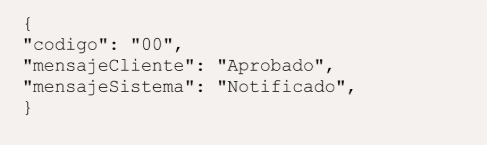
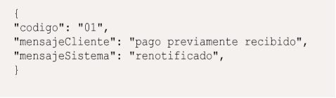
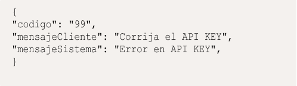

> ⚠️ **TRANSLATION PENDING:** This document is currently in Spanish. Contributions to translate it to English are welcome.

![ref1]

**API Notificación de Pago (Calidad) **

|
**Documentación** 

**técnica Control de versiones** 
|**Fecha: 11/09/2025** |||||
| - | - | :- | :- | :- | :- |
|**Nombre del Servicio** |**Versión** |**Fecha**|
`  `**Nueva** 

**Versión** 
|**Descripción del cambio** ||
|||||||
**Documentación API Notificación de Pago Descripción** 

Es un servicio usado para notificar la recepción fondos en su cuenta del Banco de Venezuela a través de pago móvil, usando para ello un mensaje automatizado que se envía desde el Banco de Venezuela y que recibe la persona jurídica a través de un Webhook habilitado para tal fin, esta notificación es generada en línea al producirse cada evento. 

**Método** POST 

**URL** 

URL indicada por CLIENTE debe ser una URL segura tipo https 

**Header **

|Servicio |API Notificación de Pago |
| - | - |
|Tipo |Post |
|Header |API-KEY:  97F6F54EF1A84F3A24FE19A3B338C77A (Empresa de prueba) |
|Content-Type |Application/json |

Esta API KEY será utilizada únicamente en ambiente de calidad y es la única válida en este ambiente. 

**Parámetros del JSON** 

**Av. Universidad, esquina Sociedad, Edificio Banco de Venezuela, Caracas, Distrito Capital                                                                                                              Rif: G-20009997-6      ![ref2]**

![ref3]
![ref1]

- " bancoOrdenante ": "0105", 
- " referenciaBancoOrdenante ": "604954047504", 
- " idCliente ": " V503045019", 
- " numeroCliente": "04243814360", 
- " idComercio ": "04241528620", 
- " numeroComercio ": " J503045019", 
- " fecha ": "20250218", 
- " hora ": "1009", 
- " monto ": "30.0", 

--- Código banco origen 

--- Referencia de banco origen 

--- Cedula del pagador 

--- Número de teléfono del pagador --- Rif 

--- Número de teléfono del beneficiario --- Fecha formato año, mes, día 

--- Hora 

--- Importe en bolívares 

**Av. Universidad, esquina Sociedad, Edificio Banco de Venezuela, Caracas, Distrito Capital                                                                                                              Rif: G-20009997-6      ![ref2]**

![ref3]
![ref1]

**Ejemplo de JSON** 

{ 

`  `"bancoOrdenante": "0105", 

`  `"referenciaBancoOrdenante": "604954047504",   "idCliente": "V503045019", 

`  `"numeroCliente": "04243814360", 

`  `"idComercio": "J503045019", 

`  `"numeroComercio": "04248131266", 

`  `"fecha": "20250218", 

`  `"hora": "1009", 

`  `"monto": "30.0" 

} 

**Respuesta Exitosa (JSON) Respuesta** 

**status:** 200. 

**codigo:** 00 - código asociado al estado de la Notificación. **mensajeCliente:** mensaje de aprobado. **mensajeSistema:** notificado.** 

**Ejemplo de respuesta** 

**Respuesta** 

**status:** 200.** 

**codigo:** 01 - código asociado al estado de la Notificación. **mensajeCliente:** mensaje de pago previamente recibido. **mensajeSistema:** Renotificado. 

**Ejemplo de respuesta** 

**Respuesta** 

- **status:** 200. 
- **codigo:** 99 - código asociado al estado de la Notificación. 
- **mensajeCliente:** Corrija el API KEY. 
- **mensajeSistema:** Error en API KEY. 

  **Ejemplo de respuesta** 

**Nota: Estos son los tres únicos códigos de respuestas que se esperan recibir del webhook.** 

**NOTA: para las notificaciones de otro banco se le envía la VRifEmpresa de la propia empresa debido a que swich no nos manda la cedula** 
**Av. Universidad, esquina Sociedad, Edificio Banco de Venezuela, Caracas, Distrito Capital                                                                                                              Rif: G-20009997-6      ![ref2]**

![ref3]

[ref1]: Aspose.Words.be9cb4ba-ab07-4989-a3ae-94ab179cf319.001.png
[ref2]: Aspose.Words.be9cb4ba-ab07-4989-a3ae-94ab179cf319.005.png
[ref3]: Aspose.Words.be9cb4ba-ab07-4989-a3ae-94ab179cf319.006.png
