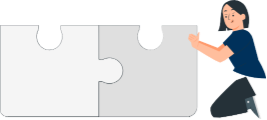
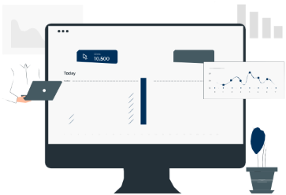
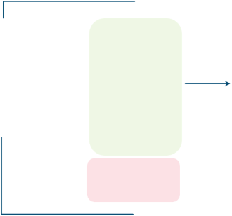
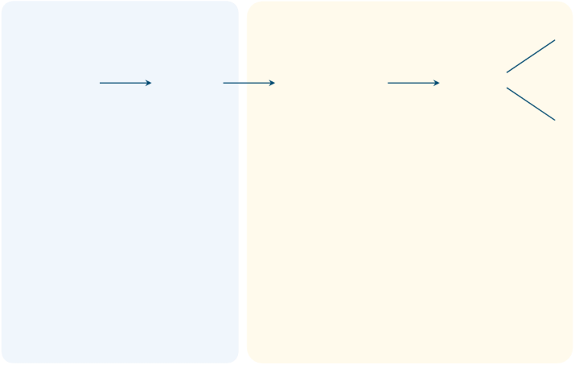
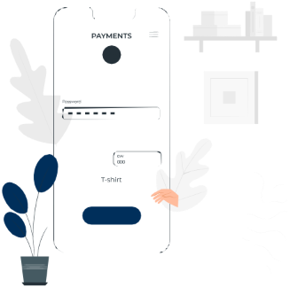
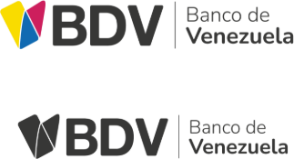
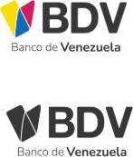
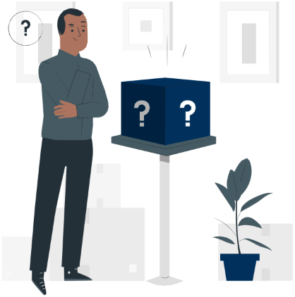

> ⚠️ **TRANSLATION PENDING:** This document is currently in Spanish. Contributions to translate it to English are welcome.

Botón de Pago![ref1]![ref2]

 Consideraciones Técnicas

` `![ref3]

Contenido Botón de Pago![ref1]

Funcionamiento

¿Cómo integrar el Botón de Pago?![ref4]![ref4]

  Preguntas frecuentes 

Punto de contacto![ref3]

![ref1] ![ref2]

Antes de comenzar, quiero aclarar algunos términos que manejaremos durante la presentación.

**Usuario:** son las personas que realizan compras en  **Banca Movil BDV:** es un servicio del BDV que envía ![ref5]un  comercio  electrónico  y  pagan  a  través  del  notificaciones de claves a través de un mensaje de Botón  de  Pago.  Pueden  ser  clientes  habituales  del  texto  (SMS).  Estas  notificaciones  se  utilizan  para comercio o pueden ser nuevos clientes. confirmar  operaciones  realizadas  a  través  de  la aplicación  móvil  BDV,  como  transferencias,  pagos 

y consultas de saldo.

**Comercio electrónico:**  es un sitio web donde los  **AMI :** es una aplicación móvil que genera códigos usuarios realizan compras a través de internet. dinámicos  que  permiten  a  los  clientes  del  BDV 

autenticarse en los canales y servicios del banco.

**Tokens:** es una clave de un solo uso que se recibe  **Códigos dinamicos:** son códigos de seguridad que para  realizar  operaciones  bancarias.  Los  tokens  se  se  muestran  en  la  app  móvil  del  cliente  al utilizan  para  agregar  una  capa  adicional  de  momento  de  realizar  una  operación.  Los  códigos ![ref3]seguridad a las transacciones en línea. dinámicos   son   necesarios   para   verificar   la identidad del cliente y evitar fraudes.

¿Sabes qué es un Botón de Pago?

Es una solución de cobro para el comercio electrónico, que permite a los 

comercios afiliados al servicio autorizar pagos en línea.

Los comercios pueden agregar un Botón de Pago a su sitio web o tienda en línea, y los usuarios pueden usar el botón para pagar con tarjeta de crédito o débito del BDV.

![ref3]

¿Cómo funciona el Botón de Pago para los usuarios de tu comercio?

**Sitio web del Botón de Pago**

**comercio **

**Usuario  Comercio Botón de Usuario** Transacción  **Comercio Usuario**

**Pago ** Aprobada

**1 2 3 4 5 ![ref6] 6 ![ref6]![ref7]![ref7]**

Verifica  el  

pago 

realizado  y  Recibe el Realiza un  Crea la  Lnae turalsolicitoa jaurl íduicosuarliao   Cinofomrmplaectiaónla  ejecuta  la resultado  de 

penedidel o online  ppetagicioónde dlea siguiente información: solicitada  por  compra. la operación. comercio  compra  • El instrumento de  el **botón de**  Transacción  Finaliza la 

afiliado a  realizada por  pago. **pago.** Rechazada operación.

**Botón de**  el usuario y  • Código  de **Pago.** lo redirige al  autenticación. ![ref3]

**Botón de  Para el cliente jurídico  Pago. adicionalmente** 

**solicita:** 

- RIF de la empresa 
- Cédula del  autorizado 

  ¿Cómo integrar Botón de pago?![ref1]

![ref3]

![ref1] ![ref2]

BiopagoBDV ofrece dos entornos para integrar el Botón de Pago en la plataforma de tu comercio:

**1**  Entorno de calidad  **2** Entorno de producción

Este  entorno  es  para  probar  la  integración  Este entorno esta diseñado para que puedas del  Botón  de  Pago  en  tu  comercio.  No  se  procesar pagos reales en tu comercio. procesarán pagos reales en este ambiente.

Para integrar el Botón de Pago en tu plataforma, debes seguir las instrucciones que se proporcionan en la 

documentación de BiopagoBDV.

¿Cómo integrar Botón de Pago?

Para lograr una integración exitosa, ágil y confiable, hemos dispuesto de un sitio web con la        ![ref3]documentación necesaria. En este sitio web encontrarás detallado el proceso de interacción con la solución. Para acceder a la documentación, ingresa al siguiente URL:

[Link](https://script.google.com/macros/s/AKfycbz5acyBkwBbcqt9rC6wHX6rb1nPX2UZXQBPO08JOBWQDCY4HWqiych3jcfF7g9P2O0dDg/exec)

¡Aquí te cuento los pasos que debes seguir para realizar la integración!

![ref1] ![ref2]

**1**de  calidad.  La  información  se  enviará  a  la  misma 

Para realizar el proceso de integración, debes solicitar a BiopagoBDV  el usuario y  la contraseña  para  el entorno 

dirección  de  correo  electrónico  del  comercio  de  donde se realizó la solicitud.

**3** Tqueente oprorneoporstádencioc anahalidrbieamdli.toasdasun paralistado redaelizacérdulaspruedbase i d eennti d aedl![ref8]

**2** integrar el Botón de Pago.

Una  vez que tengas el usuario y  la contraseña, puedes 

acceder  al  entorno  y  seguir  las  instrucciones  para **4** Uabumunneabrneivequenusztieosqitdduoeeeplscaaearlaiihmdaapaydaga,senanerlccoacomorpmpprooleerdrtacuaticdiovcoaidólendab.seelSpBigruDeaelVrab.cnaoEtsmiszteeaonrrceieeosll![ref9]

no cumple con este requisito, no podrá pasar a

producción hasta que adapte la imagen de la marca.

![ref1] ![ref2]

También debes saber que: ![ref3]

El  proceso  de  cierre  se  ejecuta  diariamente  a  las  El  monto  de  las  ventas  se  abonará  en  la  cuenta  del 11:00pm de manera automática. Esto significa que no es  afiliado  la  madrugada  siguiente  al  cierre  de  las necesario que hagas nada para iniciar el proceso. operaciones.

Aquí hay algunos consejos para garantizar el buen uso de la imagen corporativa del BDV:

![ref1] ![ref2]

**1**UsaBDV  lodes acoculoeres,rdo  ecol nlo golastipdiorecy triceel disseñooficiadlees .la marca del ![ref9]**3**

No  uses  la  imagen  corporativa  del  BDV  para  fines ![ref8]promocionales o comerciales sin el permiso del BDV.

**2** Npeormmodiso ifiqdeluesBD Vl.a  imagen  corporativa  del  BDV  sin  el **4** Usasea  respla imaetugeosan  coy rpoaderacutivaada.del BDV de una manera que 

![ref1] ![ref2]

Si tienes alguna pregunta sobre el uso de la imagen corporativa del BDV, comunícate con el BDV.

`  `![ref3]

Para finalizar la integración, debes saber lo siguiente:

![ref1] ![ref2]

Ambiente de calidad

**Persona natural:** en el entorno de pruebas, los pagos se autentican   mediante   tokens   enviados   por   correo electrónico,  al  correo  electrónico  configurado  en  la solicitud de pago.

**Persona jurídica:**

1. **La  autenticación:**  se  realiza  a  través  de  claves dinámicas  de  un  solo  uso  generadas  por  el aplicativo  “ami”.  Para  el  ambiente  de  calidad,  el número de la clave dinámica siempre será 11111111.
1. **Para  las  pruebas**,  puedes  ingresar  cualquier número de RIF en la solicitud de pago.

Ambiente productivo

**Persona natural:** la autenticación del pago se realiza a través de  tokens enviados por  mensaje  de  texto  (SMS) al número de teléfono afiliado a Banca móvil BDV en el Banco de Venezuela o a través de la app “ami”

**Persona jurídica:**

1. **Afiliación:**   el   usuario   master   de   BDVenlínea empresas  debe  afiliar  y  permitir  a  los  usuarios autorizados que harán uso del botón de pago.
1. **Tokens:**  el  usuario  autorizado  debe  tener  una ![ref3]cuenta  activa  en  el  aplicativo  “ami”.  El  aplicativo 
- AMI”  es  un  aplicativo  móvil  que  permite  a  los usuarios  generar  claves  dinámicas  para  validar  su identidad.

![ref1]

 Preguntas frecuentes

![ref3]

![ref1] ![ref2]

Preguntas Frecuentes

1. ¿Quiénes  pueden  comprar  a  través  del  Botón  de  3. ¿Qué  métodos  de  pago  acepta  la  plataforma  Botón  de pago? Pago?
- Personas  naturales  que  tengan  una  tarjeta  de  débito  o  La  plataforma  Botón de  Pago  acepta  pagos  en  bolívares (Bs.) a tarjeta de crédito del BDV. través de las siguientes tarjetas:
- Personas jurídicas que posean una cuenta corriente en el BDV. • Tarjetas de débito del BDV.
  - Tarjetas de crédito visa y mastercard.

![ref1] ![ref2]

2. ¿Cuál es el medio de autenticación que utiliza Botón de Pago para validar las operaciones?
- **Personas naturales:**

**Banca  Móvil  BDV:**  es  un  servicio  del  BDV  que  envía notificaciones  de  claves  a  través  de  un  mensaje  de  texto (SMS).

- **Personas naturales y jurídicas:**
- **AMI” :** es una aplicación móvil que genera códigos dinámicos que  permiten  a  los  clientes  del  BDV  autenticarse  en  los canales y servicios del banco.

  No se aceptan otras monedas o tipos de tarjetas, como las tarjetas de alimentación.

  Además, las  tarjetas  de  crédito solo se aceptan  para  el  pago  de personas  naturales.

  4\.  ¿Puede  el  cliente  utilizar  una  tarjeta  de  crédito  de  otro banco  a  través  del  Botón  de  Pago?![ref3]

  Si  el  usuario  tiene  una  tarjeta  de  crédito  de  otro  banco,  puede utilizarla a través del Botón de Pago. Sin embargo, debe asegurarse de que las compras por internet estén habilitadas en su cuenta. De lo contrario, sus transacciones podrían ser rechazadas.

![ref1] ![ref2]

Preguntas Frecuentes

Personas Jurídica

¿Cuáles son los pasos que debe realizar el usuario jurídico para poder pagar a través del Botón de Pago?

1. El usuario master de la cuenta jurídica debe ingresar a **BDVenlínea empresas** y completar el proceso de afiliación al servicio Botón de Pago.
1. Autorizar al usuario administrador para realizar pagos de la cuenta jurídica a través del Botón de Pago.

**Afiliación Perfilamiento de usuario administrador**

Para  afiliarse al servicio, el usuario master debe seguir los  El  usuario  master  debe  autorizar  a  los  usuarios siguientes pasos: administradores al servicio siguiendo los siguientes pasos:

1. Gestión de usuario / Administrador de perfiles. 1. Administrador de perfiles / Perfil de usuario.
1. Operaciones de pago / Botón de pago. 2. Realiza la búsqueda del usuario ya creado e ingresa en ![ref3]el ícono de Modificar.
1. Tipo de afiliación: Afiliación.
1. Instrumento origen.  Aceptar términos y condiciones. 3. TProdransuctosferenc/i aBos tóPnagdoes PaygoC.obros  /  Gestión  de  Otros 
1. Confirma la afiliación al servicio e indica el  resultado. 4. Confirma la actualización del usuario.

   5\. Indica el resultado.

   Punto de contacto![ref1]

![ref3]

![ref1] ![ref2]

Punto de contacto

Crear una buena experiencia contigo es nuestro mayor deseo. Por eso ponemos a disposición nuestro punto de contacto para ti. En caso de necesitar asistencia para el soporte técnico o aclarar dudas, puedes contactarnos a través de:

<solicitud.integracion@biopagobdv.com> 

<https://wa.me/584122741227>

Equipo Biopago, C.A

![ref3]

No dejes que nada te frene ![ref1]¡Aquí tu Huella tiene valor!

![ref3]

[ref1]: Aspose.Words.33594ad4-f234-4494-8640-367443733815.029.png
[ref2]: Aspose.Words.33594ad4-f234-4494-8640-367443733815.030.png
[ref3]: Aspose.Words.33594ad4-f234-4494-8640-367443733815.048.png
[ref4]: Aspose.Words.33594ad4-f234-4494-8640-367443733815.060.png
[ref5]: Aspose.Words.33594ad4-f234-4494-8640-367443733815.084.png
[ref6]: Aspose.Words.33594ad4-f234-4494-8640-367443733815.094.png
[ref7]: Aspose.Words.33594ad4-f234-4494-8640-367443733815.096.png
[ref8]: Aspose.Words.33594ad4-f234-4494-8640-367443733815.132.png
[ref9]: Aspose.Words.33594ad4-f234-4494-8640-367443733815.134.png
