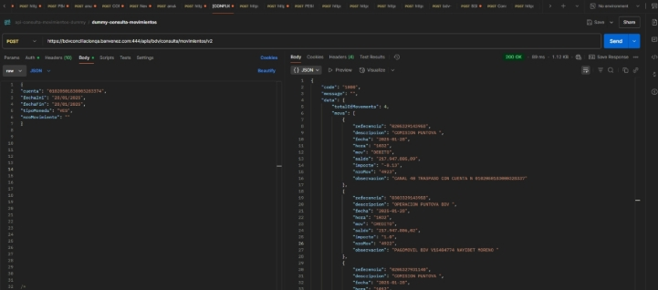

![ref1]

**API Consulta Movimiento Dummy (Calidad) **

|**Documentación técnica Control de versiones** |**Fecha: 12/03/2025** |||||
| :-: | - | :- | :- | :- | :- |
|**Nombre del Servicio** |**Versión** |**Fecha** |**Nueva Versión** |**Descripción del cambio** ||
|||||||
**Documentación  API Consulta de Movimiento Descripción**

Este endpoint permite consultar las operaciones enviadas y recibidas. 

Cuando se realiza la consulta movimientos de cuenta en la fecha actual se obtienen 100 movimientos que deben ser paginados, para realizar este proceso se debe enviar el  nroMovimiento del último registro consultado para obtener los siguientes 100. 

**Características**

1) Probar con la data tal cual como se muestra en la documentación 
1) El servicio permite hacer la consulta de los movimientos del día y por un rango de fecha, (sin incluir la fecha del día de la consulta)  
1) El api key enviado es exclusivamente para llevar a cabo pruebas en el ambiente de calidad.  

**Método** POST 

**URL** 

[**https://bdvconciliacionqa.banvenez.com:444/apis/bdv/consulta/movimientos/v2** ](https://bdvconciliacionqa.banvenez.com:444/apis/bdv/consulta/movimientos/v2)**Header** 

|Servicio |API Notificación de Pago |
| - | - |
|Tipo |Post |
|Header |X-API-Key:  256D0FDD36F1B1B3F1208A9B6EC693  (**Empresa de prueba**)  |
|Content-Type |Application/json |

Esta API KEY será utilizada únicamente en ambiente de calidad y es la única válida en este ambiente. 

**Parámetros del JSON** 

- "cuenta": "01020501830003283374",   Número de cuenta a consultar 
- "fechaIni": "01/01/2025",  Fecha inicio de la consulta 
- "fechaFin": "28/01/2025",  Fecha fin de la consulta 
- "tipoMoneda": "VES",   Tipo de moneda “VES” 
- "nroMovimiento": ""   Número de movimiento en caso de superar los 100 movimientos (pagineo) 

**Ejemplo de JSON** 

{ 

"cuenta": "01020501830003283374", "fechaIni": "01/01/2025", 

"fechaFin": "28/01/2025", "tipoMoneda": "VES", "nroMovimiento": "" 

} 

**Json de respuesta** 

**Av. Universidad, esquina Sociedad, Edificio Banco de Venezuela, Caracas, Distrito Capital                                                                                                              Rif: G-20009997-6      ![ref2]**

![ref3] ![ref4]
![ref1]

{ 

`    `"code": "1000", 

`    `"message": "", 

`    `"data": { 

`        `"totalOfMovements": 4, 

`        `"movs": [ 

`            `{ 

`                `"referencia": "0205329143958", 

`                `"descripcion": "COMISION PUNTOYA ", 

`                `"fecha": "2025-01-28", 

`                `"hora": "1032", 

`                `"mov": "DEBITO", 

`                `"saldo": "217.947.805,89", 

`                `"importe": "-0.13", 

`                `"nroMov": "4923", 

`                `"observacion": "CANAL 40 TRASPASO CON CUENTA N 0102050183000328337"             }, 

`            `{ 

`                `"referencia": "0303329143958", 

`                `"descripcion": "OPERACION PUNTOYA BDV ", 

`                `"fecha": "2025-01-28", 

`                `"hora": "1032", 

`                `"mov": "CREDITO", 

`                `"saldo": "217.947.806,02", 

`                `"importe": "1.0", 

`                `"nroMov": "4922", 

`                `"observacion": "PAGOMOVIL BDV V15404774 NAYIBET MORENO " 

`            `}, 

`            `{ 

`                `"referencia": "0205327931140", 

`                `"descripcion": "COMISION PUNTOYA ", 

`                `"fecha": "2025-01-28", 

`                `"hora": "1012", 

`                `"mov": "DEBITO", 

`                `"saldo": "217.947.805,02", 

`                `"importe": "-0.13", 

`                `"nroMov": "4921", 

`                `"observacion": "CANAL 40 TRASPASO CON CUENTA N 0102050183000328337"             }, 

`            `{ 

`                `"referencia": "0303327931140", 

`                `"descripcion": "OPERACION PUNTOYA BDV ", 

`                `"fecha": "2025-01-28", 

`                `"hora": "1012", 

`                `"mov": "CREDITO", 

`                `"saldo": "217.947.805,15", 

`                `"importe": "2.0", 

`                `"nroMov": "4920", 

`                `"observacion": "PAGOMOVIL BDV V15404774 NAYIBET MORENO " 

`            `} 

`        `] 

`    `}, 

`    `"status": 200 

**Av**}**.**  **Universidad, esquina Sociedad, Edificio Banco de Venezuela, Caracas, Distrito Capital                                                                                                              Rif: G-20009997-6**      

![ref3] ![ref4]
![ref1]

**Av. Universidad, esquina Sociedad, Edificio Banco de Venezuela, Caracas, Distrito Capital                                                                                                              Rif: G-20009997-6      ![ref2]**

![ref3] ![ref4]

[ref1]: Aspose.Words.33c9115b-3e8c-4740-b487-ae810159dbef.001.png
[ref2]: Aspose.Words.33c9115b-3e8c-4740-b487-ae810159dbef.005.png
[ref3]: Aspose.Words.33c9115b-3e8c-4740-b487-ae810159dbef.006.png
[ref4]: Aspose.Words.33c9115b-3e8c-4740-b487-ae810159dbef.007.png
