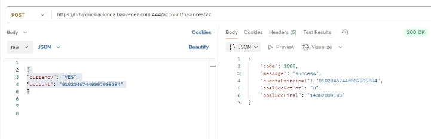

![ref1]

**API Consulta de Saldo (Calidad) **

|**Documentación técnica Control de versiones** |**Fecha: 26/03/2025** |||||
| :-: | - | :- | :- | :- | :- |
|**Nombre del Servicio** |**Versión** |**Fecha** |**Nueva Versión** |**Descripción del cambio** ||
|||||||
**Av. Universidad, esquina Sociedad, Edificio Banco de Venezuela, Caracas, Distrito Capital                                                                                                              Rif: G-20009997-6      **

1 ![ref2]![ref3]

![ref1]

**Documentación  API Consulta de Saldo Descripción**

Este endpoint permite consultar el saldo de las cuentas asociados al RIF. 

**Método** POST 

**URL** 

[**https://bdvconciliacionqa.banvenez.com:444/account/balances/v2** ](https://bdvconciliacionqa.banvenez.com:444/account/balances/v2)

**Header **

|Servicio |API Consulta de Saldo  |
| - | - |
|Tipo |Post |
|Header |X-API-Key:  256D0FDD36F1B1B3F1208A9B6EC693  (**Empresa de prueba**)  |
|Content-Type |Application/json |

Esta API KEY será utilizada únicamente en ambiente de calidad y es la única válida en este ambiente. 

**Parámetros del JSON** 

- "currency": "VES", 
- "account": "01020467440007909094"

**Ejemplo de JSON** 

{ 

"currency": "VES", 

"account": "01020467440007909094" } 

**Json de respuesta** 

{ 

`    `"code": 1000, 

`    `"message": "success", 

`    `"cuentaPrincipal": "01020467440007909094",     "ppalSdoRetTot": "0", 

`    `"ppalSdoFinal": "14382889.03" 

} 

**Av. Universidad, esquina Sociedad, Edificio Banco de Venezuela, Caracas, Distrito Capital                                                                                                              Rif: G-20009997-6**      

` `4 

![ref4] ![ref3]

[ref1]: Aspose.Words.e32734ce-d9fe-4411-9740-d87e963ce1ff.001.png
[ref2]: Aspose.Words.e32734ce-d9fe-4411-9740-d87e963ce1ff.004.png
[ref3]: Aspose.Words.e32734ce-d9fe-4411-9740-d87e963ce1ff.005.png
[ref4]: Aspose.Words.e32734ce-d9fe-4411-9740-d87e963ce1ff.011.png
