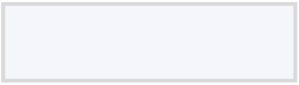

![ref1]

Documentación técnica  **PRODUCCIÓN![ref2]**

**API C2P Cuentas Múltiples**

**Control de Versiones:![ref2]**

|Versión|Fecha|Nueva Versión|Descripción del Cambio|
| - | - | - | - |
|1|19/12/2025|—|Documento inicial|

**Descripción del Servicio:**

La API C2P – Cuentas Múltiples permite realizar cobros autorizados a personas naturales, acreditando el monto del cobro en cualquiera de las cuentas asociadas al RIF del comercio.

La cuenta destino del abono se define indicando, en el JSON de entrada, el número de teléfono del comercio asociado a la cuenta correspondiente, lo que habilita el manejo de múltiples cuentas para un mismo comercio.

**Método:** POST **Ambiente:**Producción **Header**

|**Header**|**Descripción**|
| - | - |
|X-API-Key|Generado por el canal Empresas|
|Content-Type|application/json|

**Solicitud de OTP:**

**URL:** https://bdvconciliacion.banvenez.com:443/BankMobilePaymentC2P/MultipleAccounts/paymentkey 

**Parámetros de la Solicitud:**

- customerDocumentId: número de identidad del cliente
- customerNumberInstrument: número de teléfono del cliente

**JSON de Entrada**

{

`  `"customerDocumentId":"V15404774",

`  `"customerNumberInstrument":"04123963208" ![ref3]![ref4]}

**JSON de Salida:**

{

`    `"code": "1000",

`    `"message": "Proceso finalizado",     "data": null,

`    `"status": 200

}

**Ejecución de la Operación de Cobro**

**Endpoint:** https://bdvconciliacion.banvenez.com:443/BankMobilePaymentC2P/MultipleAccounts/process

**Parámetros de la Solicitud:** 

- **customerDocumentId:** número de identidad del cliente
- **customerNumberInstrument:** número de teléfono del cliente
- **amount:** monto a cobrar
- **customerBankCode:** código del banco del cliente
- **concept:** descripción de la operación
- **otp:** clave de pago
- **coinType:** tipo de moneda
- **operationType:** indica el tipo de operación

**JSON de Entrada**

{

`  `"customerDocumentId":"V15404774",

`  `"customerNumberInstrument":"04123963208",   "amount":"2.0",

`  `"customerBankCode":"0102",

`  `"concept":"Pago",

`  `"otp":"63216413",

`  `"coinType":"VES",

`  `"operationType":"CELE"

}

**JSON de Salida:**

{

`    `"code": "1000",

`    `"message": "Transaccion realizada",

`    `"data": {

`        `"date": "2024-11-08",

`        `"endToEndId": "0102010240500008586180412396320820241108142701090037579602",         "cuenta": "",

`        `"saldoDisponible": "",

`        `"cuentaDivisa": "",

`        `"saldoCuentaDivisa": "",

`        `"referencia": "090037579602"

`    `},

`    `"status": 200

}

**Operación de Anulación Endpoint:**

https://bdvconciliacion.banvenez.com:443/BankMobilePaymentC2P/MultipleAccounts/annulment

**Parámetros de la Solicitud:** 

- endToEndId: identificador único de la operación
- referenceOrigin: referencia obligatoria para anulación interbancaria

**JSON de Entrada**

{

`    `"endToEndId":"0102010240500008586180412396320820241108142701090037579602",     "referenceOrigin":""

}

**JSON de Salida**

{

`    `"code": "1000",

`    `"message": "reverso realizada",     "data": {

`        `"date": "2024-11-08",

`        `"endToEndId": "",

`        `"cuenta": "",

`        `"saldoDisponible": "",

`        `"cuentaDivisa": "",

`        `"saldoCuentaDivisa": "",

`        `"referencia": null

`    `},

`    `"status": 200

}

**Tabla de Errores del Servicio:**

- **1000 –** Transacción realizada
- **1002 –** Ha ocurrido un error envío conector
- **1006 –** El Rif suministrado no es Merchant
- **1013 –** Monto inválido
- **1014 –** Beneficiario no afiliado a PagomóvilBDV
- **1015 –** No afiliado a ClavemóvilBDV
- **1026 –** Referencia / Monto duplicado
- **1034 –** Saldo insuficiente
- **1041 –** Servicio inactivo
- **1050 –** La solicitud superó el Timeout
- **1055 –** Clave no existe
- **1056 –** El número de teléfono no corresponde con el titular
- **1061 –** Monto supera el límite diario
- **1062 –** Cuenta con inconvenientes
- **1065 –** Cantidad de transacciones superada
- **1080 –** Documento de identidad inválido
- **1091 –** Banco destino inactivo
- **1092 –** Banco destino no afiliado
- **1094 –** Operación duplicada
Av. Universidad, esquina Sociedad, Edificio Banco de Venezuela, Caracas, Distrito CapitalRif: G-20009997-6     ![ref3]![ref4]

[ref1]: Aspose.Words.9705e99f-b2e4-45b4-a769-a05e4b78c2c9.001.png
[ref2]: Aspose.Words.9705e99f-b2e4-45b4-a769-a05e4b78c2c9.002.png
[ref3]: Aspose.Words.9705e99f-b2e4-45b4-a769-a05e4b78c2c9.005.png
[ref4]: Aspose.Words.9705e99f-b2e4-45b4-a769-a05e4b78c2c9.006.png
